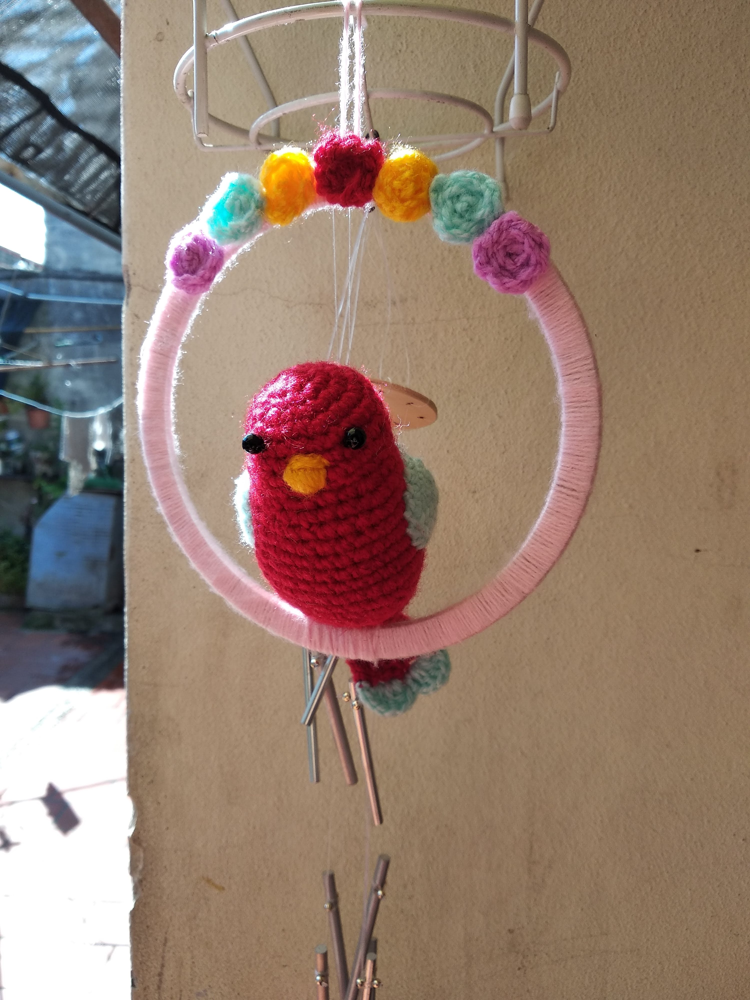

# Presentación
Hola! Me presento mi nombre es Melina Alvarez y estoy en mi segundo año de la Tecnicatura en Programación.

## Sobre mi

Comence la carrera en 2023 con muchas expectativas pero también con dudas ya que no sabia si era a lo que me quería dedicar o si iba a poder entender todo pero con el paso del tiempo fui descartando esos miedos y comence a duisfrutar más.
Siempre tuve un interes por la informática pero mis conocimientos eran basicos, y al comenzar la carrera pude profundizar más y comenzó a interesarme mucho más de lo que pensaba, asi que hoy en dia estoy bastante motivada con lo que estudio y quiero seguir aprendiendo lo mas que pueda. 

## Mis gustos:
* Voley, es un deporte que me gusta por lo que este año comence a entrenar en un club.
* Disfuto escuchar radios en streaming, principalmente LUZU TV. Y mi programa favorito es Tarde de Tertulia.
* Cultura asiática, me interesa bastante todo lo relacionado a otras culturas (ya sea su historia, costumbres, festividades, comidas, etc.) pero principalmente mi interes esta puesto en Japón y Corea.
* Crochet, es un interes que considero que obtuve de mi abuela ya que a ella también le gusta tejer y siempre me enseño al respecto.

